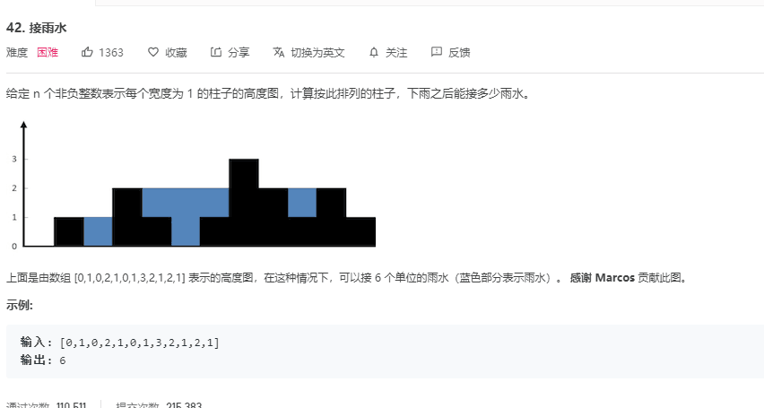

<!--
 * @Author: Weidows
 * @Date: 2020-11-24 21:27:26
 * @LastEditors: Weidows
 * @LastEditTime: 2020-11-28 17:44:52
 * @FilePath: \Weidows\README.md
 * @Description:
-->

<h1 align="center">

⭐️ Weidow's 🌈 の Mind ⭐️

</h1>

# 🌈 简介 & 资源提示よ (Brief Intro)

    这仓库就是一学习笔记,没啥可看的,看名字就能明白,需要找啥自取就行
    需要注意的是本项目下markdown多采用绝对URL路径引用(便于移植到Gitee-Pages),
    其他文件比如HTML可能使用的是相对引用(自己学习时写的笔记)

# C++

- [C++](./C++/)内有一些简单算法和数据结构题和作业,都有注释,需要的话自取

  - 1.[链表](./C++/Data_struct/LinkedList/) 分有 123,3 里面是带界面的最终版本

  - 2.[四种方法求最大公约数](./C++/Arithmetic/求最大公约数/methods_of_calculating_Max_common_divisor.c)

  - 3.[算法题-求雨滴积累数(本人用的递归)](./C++/Arithmetic/递归-求雨滴积累数/1.c)
    

  - 4.[C++项目:winter](./C++/Project/winter/) B 站上一位大佬做的模拟电脑项目(已开源)

# Web

- [群友给的 MC 的小 web](./Web/mc.geek.net/)

- [一些加载动画](./Web/loading/)

# Java

- [Java](./java/src/main/java/)里面是根据浙大翁凯老师的课程做的源代码笔记等等...
  里面每个 demo 是一个独立 package 而非 project,如果需要导入 IDEA 需要改一下

  - 1.[狐狸与兔子源码](./java/src/main/java/twenty/july/my_interface/)
    

    - 这个是翁凯老师课程 6.3(狐狸与兔子)的源代码内容,中国大学 MOOC 上没有给出,老师的讲解也不全面,网上的资源都...甚至还有 10RMB 出售的(大醉),此处给出送给有缘人:)
    - 另外,还有[细胞自动机源码](./java/src/main/java/twenty/july/data_depart_behave/) / [下一章 7.x 的狐狸与兔子源码](./java/src/main/java/twenty/july/control_inversion/)
    - 小小诚意,不求 Star 了,一起共勉!

  - 2.[贪吃蛇小程序-README](./java/src/main/java/demos/snake_game/README.md)
    别人做的小程序,在此学习一下 Java 基础

# Others

- [Others](./Others/)目录有一些其他语言的花里胡哨...以及 Markdown 等文件(各种随笔 & 他人项目)
  - [2016 年世界编程大赛状元作品(这可不是我的啊!!!)](./Others/hg_fermi-paradox-20161105)
    

# Python

- [Python](./Python/)
  - 1.目录里面有个 520 表白(Claim Love.py)的单文件源码,作者是别人(开源了),在此给路人行个方便...

# 暂无

    * 暂无其他  loading...

# [反馈 & 出处 (Aboue me & Click me)](https://weidows.gitee.io/tags/about)

    后续会更新,同时欢迎有兴趣的提出修改意见或共同整改!

